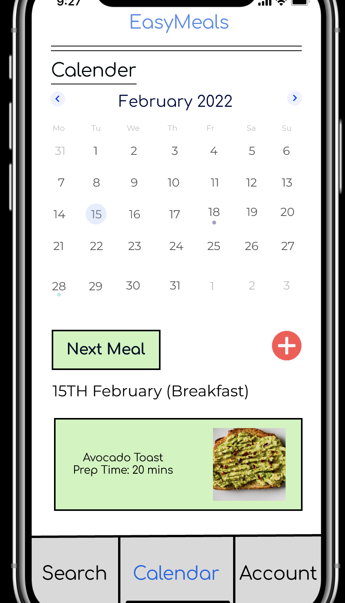
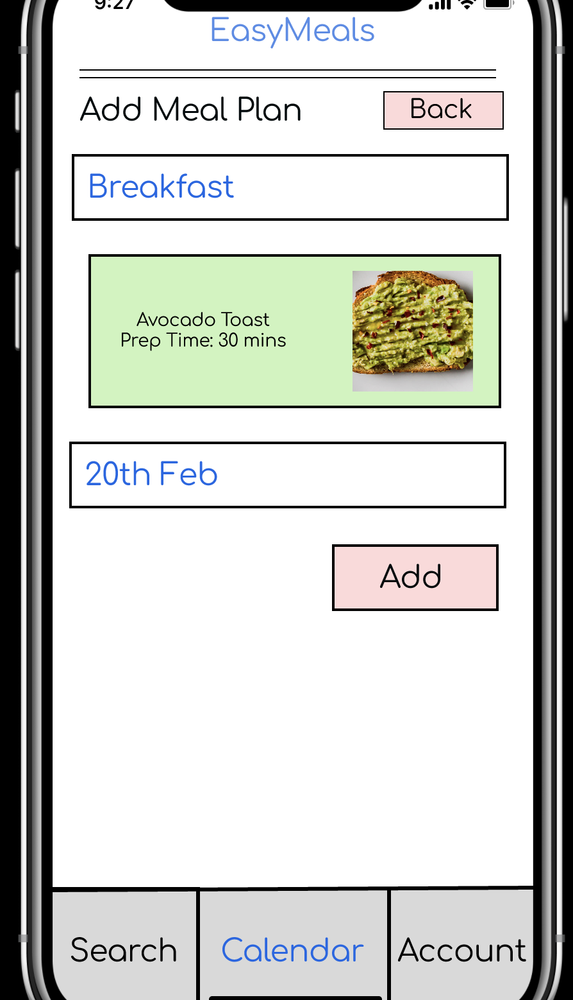
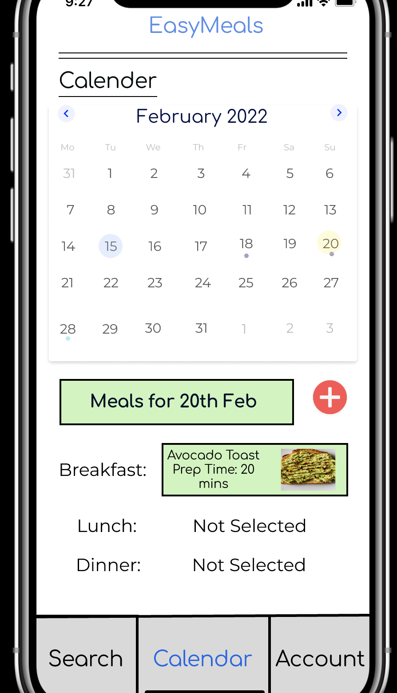
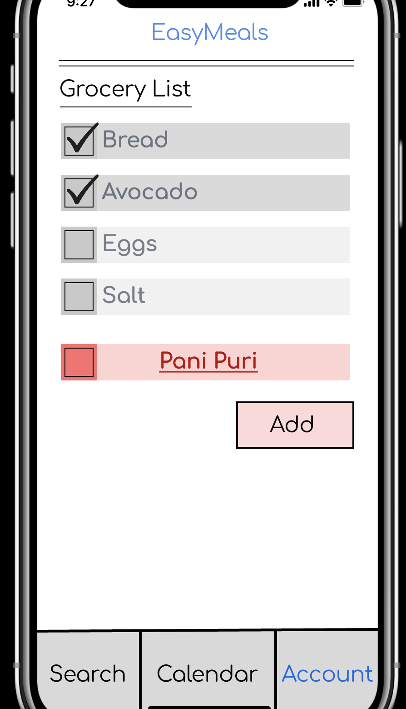
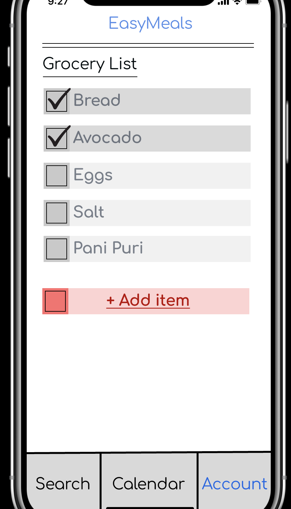
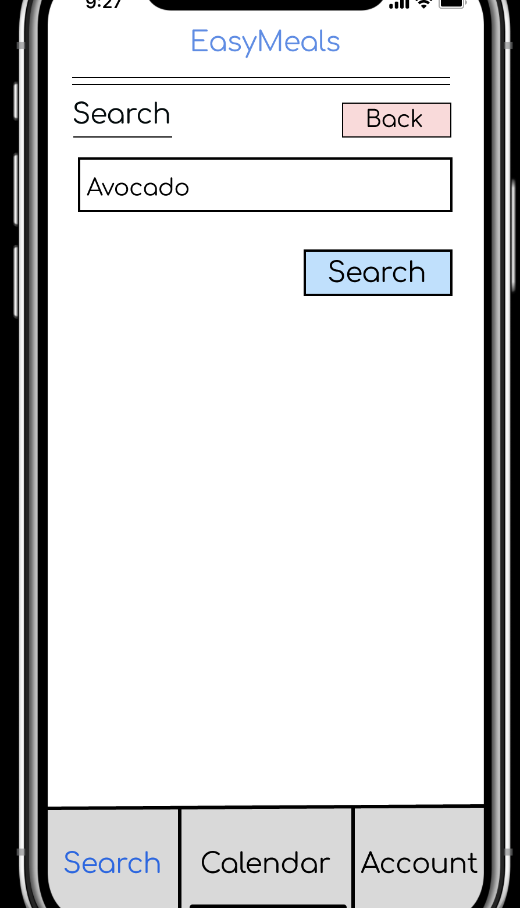
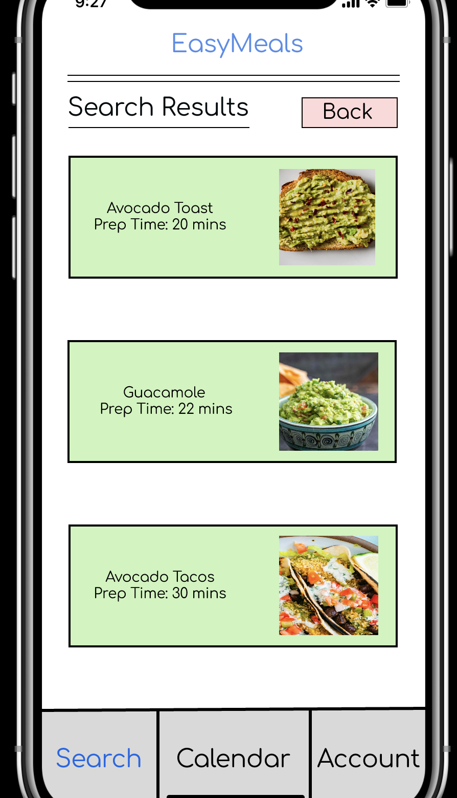
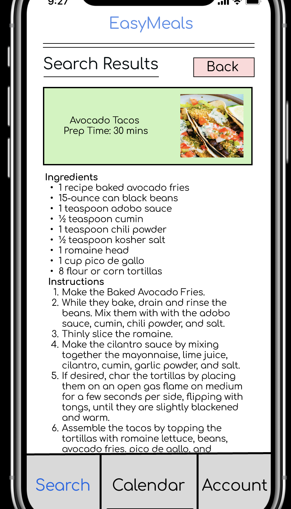

# EasyMeals: Meal Prep for College Students

**[EasyMeals](https://www.figma.com/proto/d3grPInkYXJZabTRPOidNp/Individual-Assignment-2?node-id=6-1162&starting-point-node-id=6%3A1162&mode=design&t=m1j8zA6oGlhjS1NE-1)** is a mobile app designed to simplify the lives of busy college students living in on-campus apartments who wish to cook their meals while optimizing their time. This mobile interface app caters to the unique needs and time constraints faced by college students by providing a range of features, including efficient meal planning, streamlined grocery shopping, quick and relevant recipe searches, reduced food waste, and the ability to locate nearby grocery stores.

## [User Research](research)

To develop EasyMeals, extensive [user research](research) was conducted, including a [cultural probe](research) and interviews with college students John Doe and Jane Doe, who perfectly represent the target audience. They expressed a strong desire for an app that helps them utilize existing ingredients, reducing the need for frequent grocery shopping. Both John and Jane highlighted the importance of knowing what meal to prepare in advance.

## Features

### Customizable Meal Calendar

EasyMeals offers a customizable meal calendar, allowing students to efficiently plan their breakfast, lunch, and dinner for any day. This feature promotes organization and time-saving, ensuring students have healthy, home-cooked meals readily available.

### Grocery List Management

The grocery list feature enables users to easily add or remove ingredients for their shopping trips. This tool ensures that students are fully prepared for their cooking endeavors and helps them avoid last-minute grocery store runs.

### Ingredient-Based Recipe Search

EasyMeals simplifies the process of finding recipes based on specific ingredients or meals. Users can search for an ingredient, and the app displays meals containing that ingredient. This feature streamlines the cooking process, reduces food waste, and encourages culinary exploration.

## Conclusion

EasyMeals was created with the input of college students who fit the target demographic – those who want to cook often but save time. This app addresses the challenges faced by college students, ensuring they can balance their academic responsibilities with cooking healthy meals.

By offering a customizable meal calendar, grocery list management, and an ingredient-based recipe search, EasyMeals empowers college students to effortlessly plan, shop for, and prepare meals. This app is a testament to the dedication to meeting the needs and preferences of college students who cook their meals, making their cooking process more efficient and enjoyable.

**[EasyMeals: Meal Prep for College Students](https://www.figma.com/proto/d3grPInkYXJZabTRPOidNp/Individual-Assignment-2?node-id=6-1162&starting-point-node-id=6%3A1162&mode=design&t=m1j8zA6oGlhjS1NE-1)**
