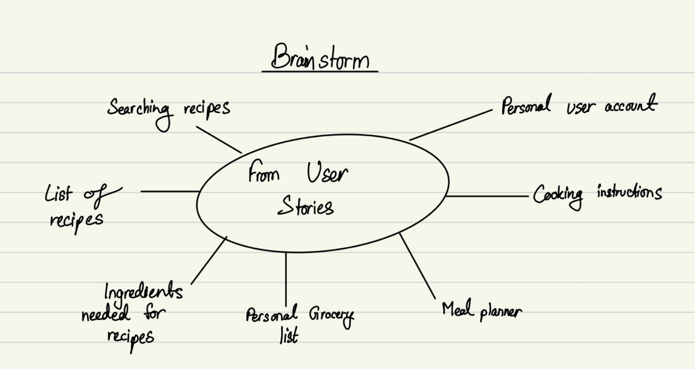
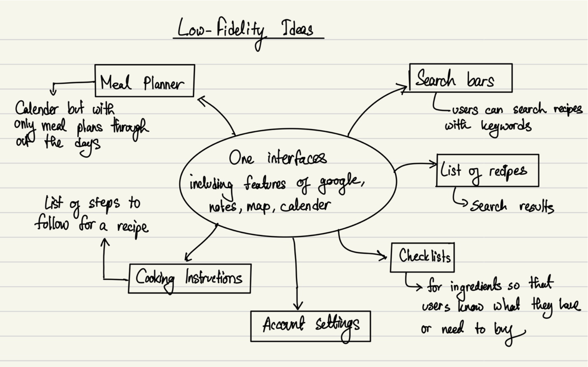

# EasyMeals Mobile App

## Brainstorming

### User Stories

**User 1:**
John Doe, a college student living on campus next to a regular grocery store, wants an app that helps him save time and effort in his cooking routine. He cooks at least 5 times a week, and his grocery shopping and leftover habits vary. Half the time, he looks for recipes to cook. John would find it helpful if the app could suggest meals he can cook with the ingredients he already has in his kitchen, reducing the need for grocery shopping. He wants the app to be free to use and accessible on his mobile device. By using this app, John hopes to improve his meal planning process and save time and effort in his cooking routine.

**User 2:**
Jane Doe, a college student living on-campus near the downtown area, wants an app that helps her save time and effort in her daily cooking routine. She cooks at least once a day in a week, and her grocery shopping frequency varies. Jane rarely has leftovers, and she always looks for recipes when she cooks. She thinks it would be useful if the app could suggest meals she can cook with the ingredients she already has in her kitchen, reducing the need for grocery shopping. Additionally, Jane wants to plan ahead.

### Mobile Interface Features

Based on the user stories above, the EasyMeals mobile interface app will include the following features:

1. **Search Bar:** Users can search for specific recipes using keywords such as ingredients, cuisine, etc.
2. **Recipe List:** Display recipes that are tailored to the user's search query and include a thumbnail image of each recipe, along with the title and cooking time.
3. **Ingredients List:** Provide a list of all the ingredients needed to make the recipe.
4. **Grocery List:** Users can add items to their grocery list as they browse recipes. They can access the list when they go shopping.
5. **Meal Planner:** Users can plan their meals for the week by selecting recipes from their saved recipes and then adding them to their meal planner.
6. **Cooking Instructions:** Display step-by-step instructions for each recipe, along with images.
7. **User Account:** Allow users to save their favorite recipes, create a meal plan, and access their grocery list from any device.

### Low-Fidelity Ideas

Some low-fidelity prototype ideas for the interface pages:

1. **Search Bar:** A search bar at the top of the page that allows users to enter keywords. As the user types, the search results will automatically appear in a list below the search bar.
2. **Recipe List:** A list of recipes that includes a thumbnail image, recipe title, rating, and cooking time. Users can click on a recipe to view more details.
3. **Ingredients List:** A checklist of all the ingredients needed to make the recipe.
4. **Grocery List:** The user's grocery list, with options to add or remove items.
5. **Meal Planner:** A calendar view that allows users to select recipes for each day of the week. Users can click on a day to see the recipes they have planned for that day.
6. **Cooking Instructions:** A step-by-step list of instructions with images.
7. **User Account:** A user profile page that allows users to view their saved recipes, meal plans, and grocery list.

**Note:** This is a low-fidelity brainstorming phase, and the final design and features may evolve during the development process based on user feedback and usability testing.
