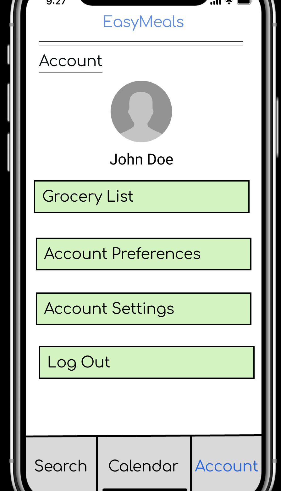
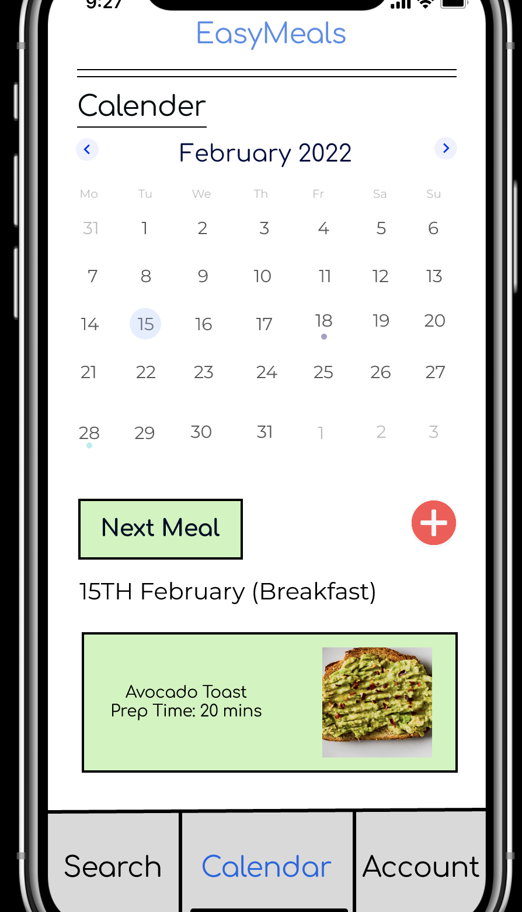
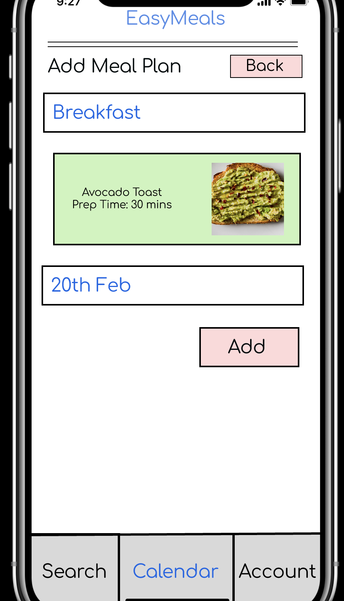
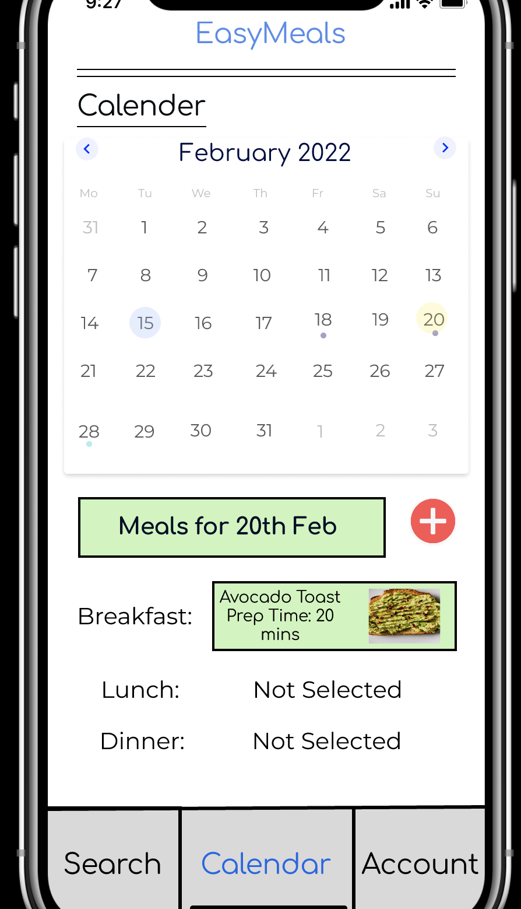
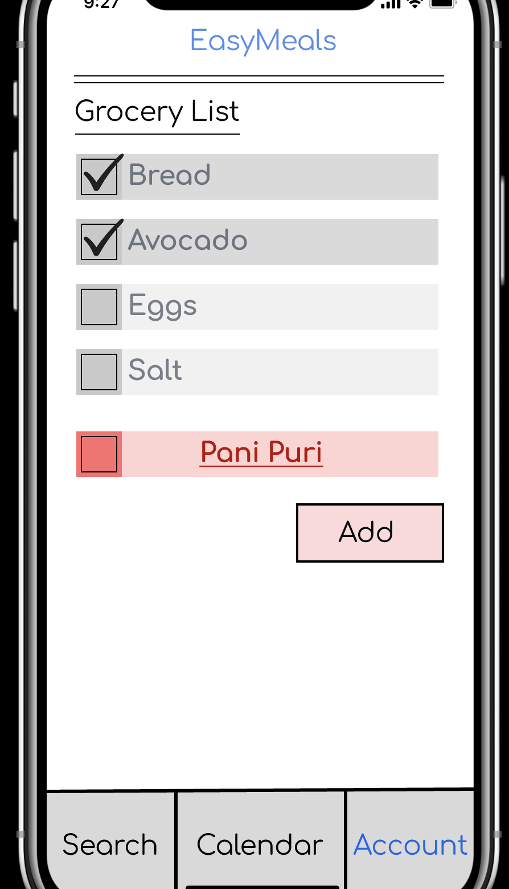
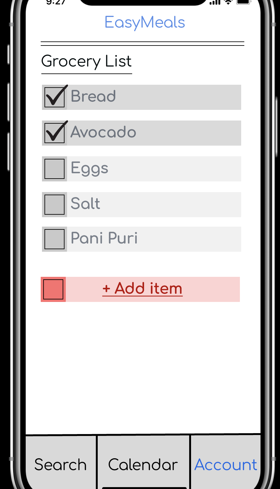
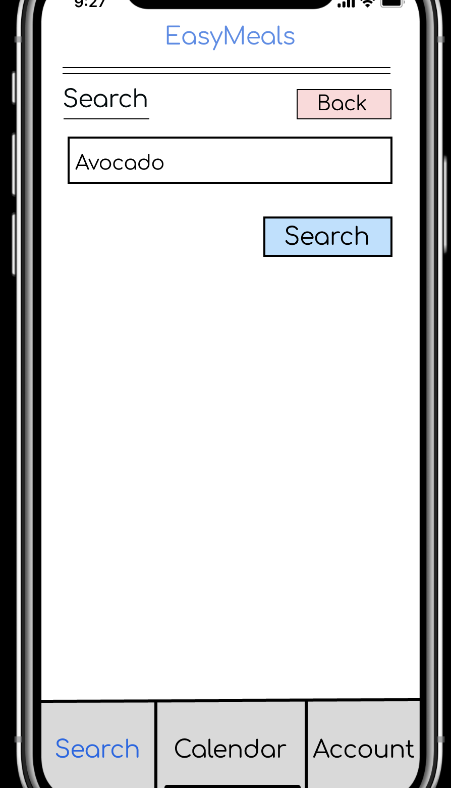
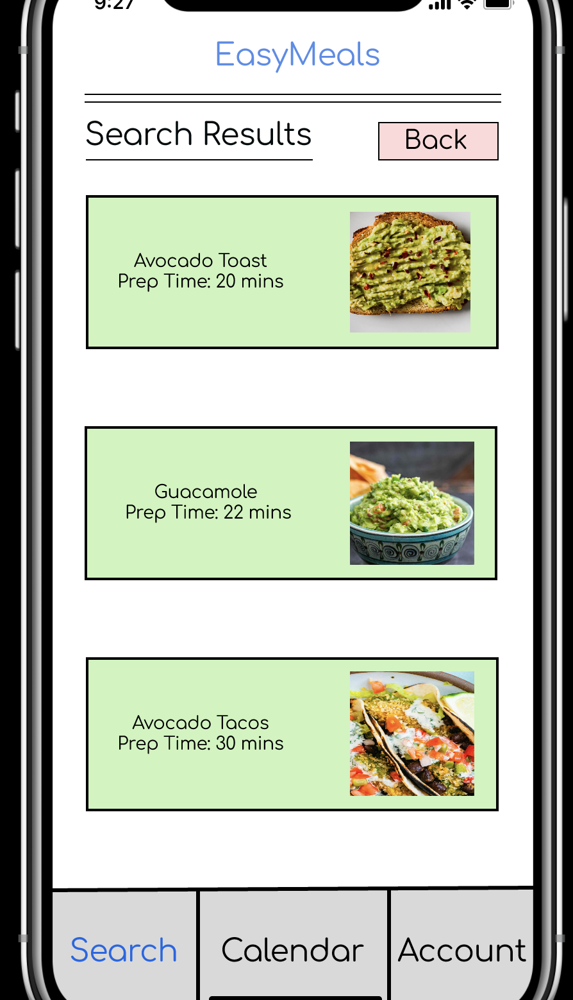
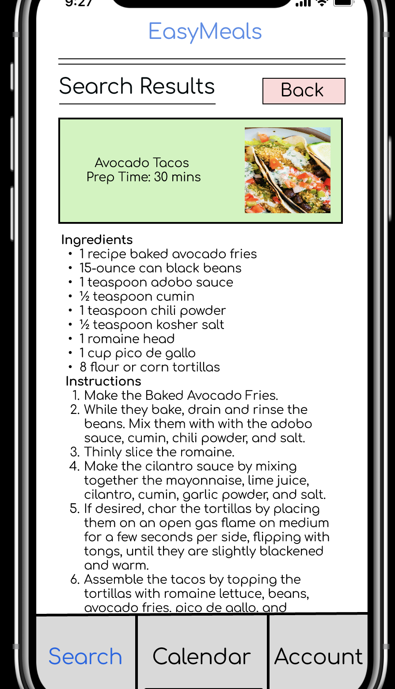

# EasyMeals Mobile App - High Fidelity Prototype

## Summary

The [high-fidelity prototype for the EasyMeals mobile app](https://www.figma.com/proto/d3grPInkYXJZabTRPOidNp/Individual-Assignment-2?node-id=6-1162&starting-point-node-id=6%3A1162&mode=design&t=m1j8zA6oGlhjS1NE-1) was developed through a comprehensive design process. The journey began with a thorough understanding of user needs, as outlined in the previously created low-fidelity prototypes and user stories of John Doe and Jane Doe. These insights were the foundation for crafting a visually appealing and user-friendly prototype that aimed to address the specific requirements and preferences of college students seeking an efficient meal planning and cooking solution.

[Explore High-Fidelity Prototype on Figma](https://www.figma.com/proto/d3grPInkYXJZabTRPOidNp/Individual-Assignment-2?node-id=6-1162&starting-point-node-id=6%3A1162&mode=design&t=m1j8zA6oGlhjS1NE-1)

## Design Process

1. **User Research:** The design process commenced with user research, incorporating feedback and insights gained from the low-fidelity prototypes. This research was vital in understanding user behaviors, pain points, and expectations related to meal planning, grocery shopping, and recipe selection.

2. **Wireframing:** Wireframes were created to establish the basic layout and functionality of the app's screens. This step allowed for early visualization and iteration of the app's structure, ensuring alignment with user needs.

3. **Figma Prototyping:** Figma, a collaborative design tool, was utilized to create the high-fidelity prototype. The platform facilitated the development of interactive and visually rich screens, enabling users to navigate through the app as if it were a fully functional product.

4. **User Testing:** To validate the design and functionality, user testing sessions were conducted with individuals representing the target audience. Their feedback played a pivotal role in refining the prototype, optimizing usability, and identifying areas for improvement.

5. **Iterative Design:** The design process followed an iterative approach, with continuous refinement based on user feedback and design team evaluations. This approach ensured that the final prototype met user expectations and addressed their pain points effectively.

## Key Features

The high-fidelity prototype in the "final-prototype" folder showcases several key features based on user insights and preferences, including:

- **User-Friendly Interface:** The prototype boasts a visually appealing and intuitive user interface, enhancing the overall user experience.
- **Customizable Meal Calendar:** Users can efficiently plan their meals for the week, aligning with their schedules and dietary preferences.
- **Grocery List Management:** The app simplifies grocery shopping by allowing users to create and manage their shopping lists.
- **Ingredient-Based Recipe Search:** Users can easily discover recipes based on available ingredients, minimizing food waste and promoting culinary exploration.
- **Cooking Instructions:** Step-by-step instructions are provided for each recipe, ensuring users can prepare meals with ease.
- **User Account:** A user profile feature allows individuals to save favorite recipes, create meal plans, and access their grocery lists from any device.

## Feedback and Contributions

Your feedback and contributions are highly valuable in enhancing the EasyMeals mobile app. Feel free to explore the high-fidelity prototype, provide feedback on usability, design elements, and overall user experience. Together, we can refine and optimize the app to cater to the specific needs of college students seeking a convenient and efficient cooking solution.

Some screenshots from the High-Fidelity Prototype:

---
