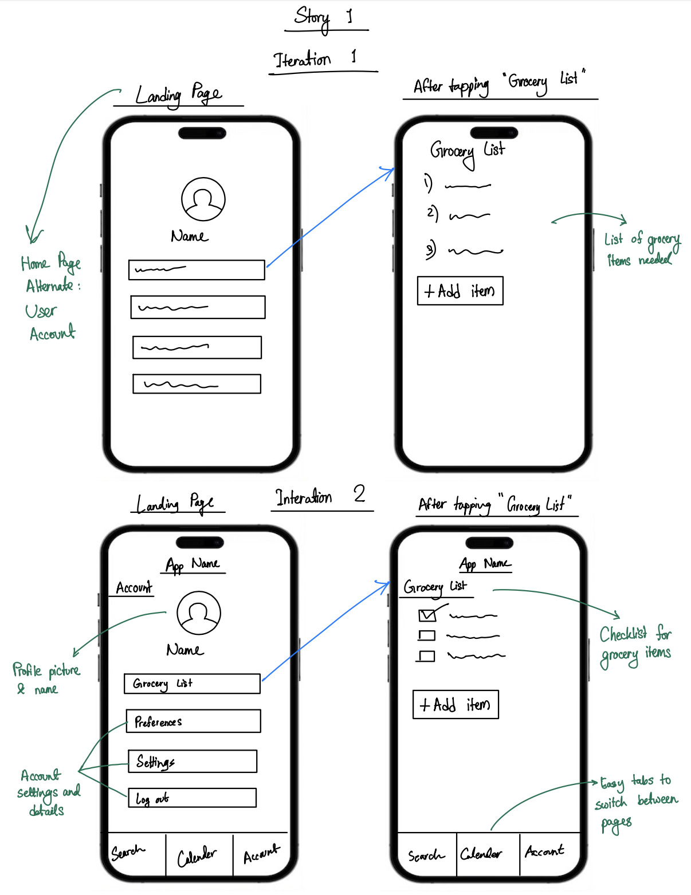
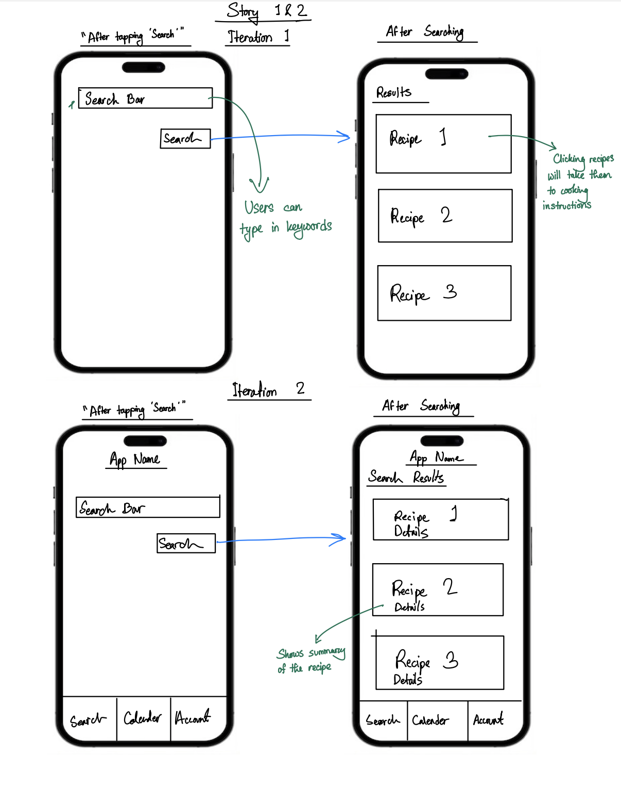
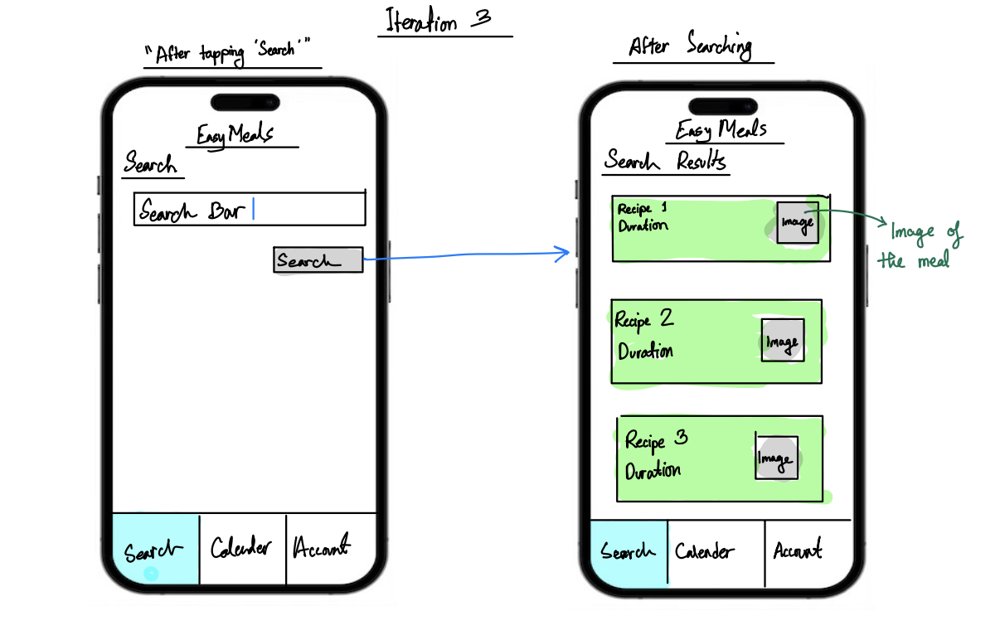
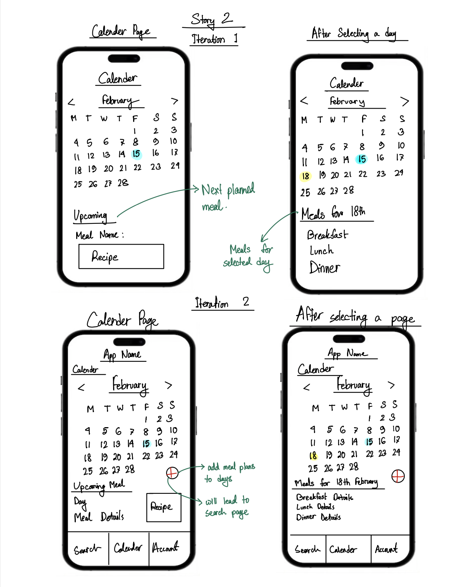
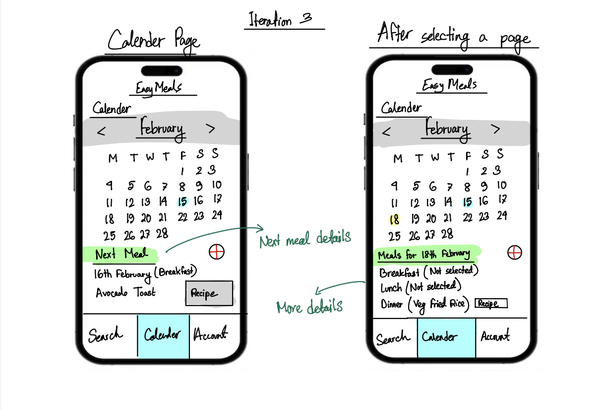

# EasyMeals Mobile App

## Lo-Fi Prototype Development

The low-fidelity prototypes for the EasyMeals mobile app were crafted by translating the user stories of John Doe and Jane Doe into visual representations. These sketches aimed to capture the users' needs and preferences and transform them into tangible representations of the app's key features. For instance, the inclusion of a search function was a direct response to the users' emphasis on finding specific recipes, leading to the sketching of a simple search bar at the top of the interface. Similarly, the desire for recipe suggestions based on available ingredients inspired the creation of sketches for an ingredients list and a recipe list complete with thumbnails and detailed information. Furthermore, the grocery list and meal planner were integrated to address the users' goals of efficient meal planning and shopping. These sketches played a foundational role in the app's design process, providing a visual framework for early feedback and insights into the app's structure and functionality.

*Please note that these low-fidelity prototypes represent an initial design stage, and the final design may evolve through user feedback and usability testing.*

[
[

[
[

[
[

---
