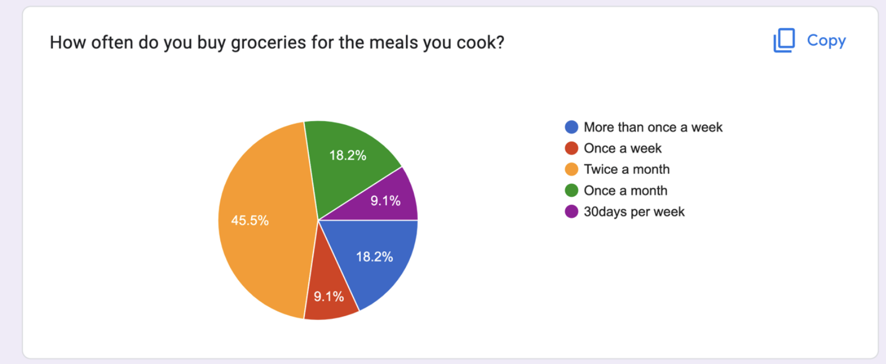

# Meal Prep Mobile Interface Prototype

## User Research

### Target Audience
The target audience for this prototype consists of college students living in on-campus apartments who frequently cook their own meals to save time and money.

### Research Methodology
To gather insights and requirements from the target audience, I conducted a user survey using a Google Form. The survey was distributed to college students who cook their own meals regularly. From the survey responses, I selected two participants who best represented the target audience's needs and preferences.

## Cultural Probe

**[Click here to see the Cultural Probe(Google Form)](https://forms.gle/Vbw1L6RHuQhrx16i7)**

### Probe Design
The cultural probe used for this study was a Google Form titled "Cultural Probe - Meal Prep." It aimed to collect data about participants' meal planning habits, grocery shopping frequency, recipe search behavior, and their opinions on potential features for a meal prep mobile app. The form consisted of the following questions:

- Participant's name
- Current meal situation (options included not knowing what to cook, needing a recipe, or knowing exactly what to cook)
- Frequency of cooking meals per week
- Frequency of grocery shopping
- Number of meals cooked at once
- Frequency of searching for meal ideas online

### Data Collection
Participants were asked to fill out the form daily for a week, providing insights into their meal planning and cooking routines. Some screenshots of the data.

## Affinity diagram and Models

The data was used to create an affinity diagram and different models to assist in brainstorming about low fidelity prototypes.

